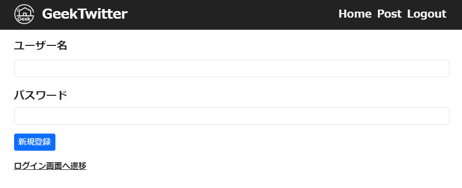
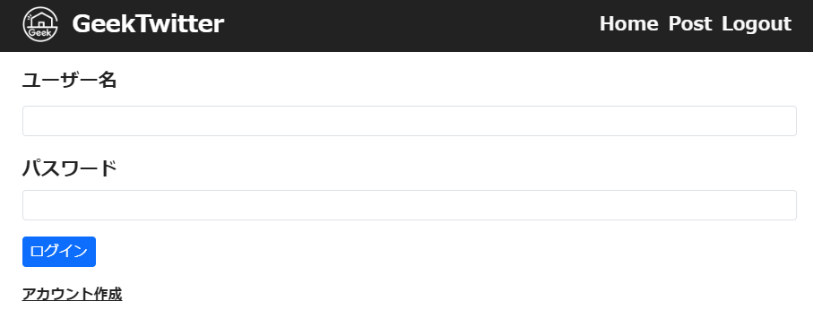
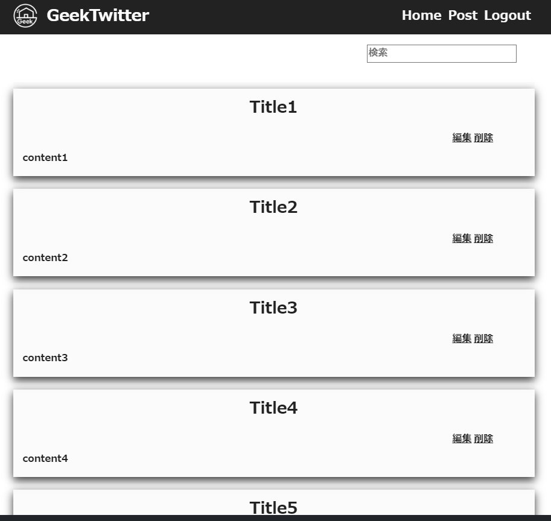
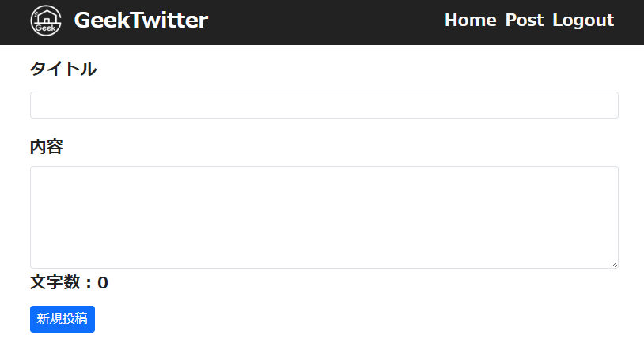

# GeekTwitter
## 実行環境
- python=3.8.19
- conda install flask==3.0.3
- conda install flask-login==0.6.3
- conda install pytz
- pip3 install flask_sqlalchemy==3.1.1
- pip3 install flask-bootstrap=3.3.7.1

## DB作成
- create_db.py で作成されるデータベースtest.db はinstance フォルダ内に作られるが、それをGeekTwitter 直下に置く必要がある

## Page Image
### SignUp Page
- ユーザー名、パスワードを登録してアカウント作成

### Login Page
- 登録したユーザー名、パスワードを使用してログイン

### Home Page
- 『検索』を押すと、 Title もしくは content に合致するワードがあるもののみ表示
- 『編集』を押すと、投稿内容の編集ページへ遷移
- 『削除』を押すと、その投稿を完全に削除
#### Header
- 『GeekTwitter』『Home』を押すと、HomePageに遷移 (※1)
- 『Post』を押すとPost Pageに遷移 (※1)
- 『Logout』を押すとログアウト状態になって、Login画面に遷移 (※1)
※1：ログイン状態でない場合は "Unauthorized" となる

### Post Page
- Title・contentを記入して新規投稿
- content部分の文字数が表示される

